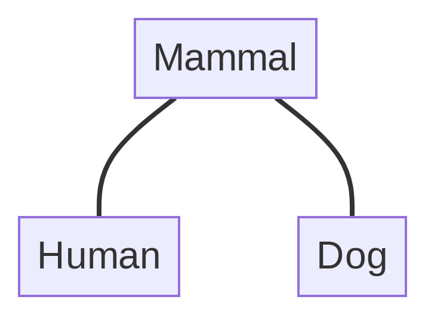

# Programming best practices

2024-05-21

## Plan

- This week, we will look at a few practices that have the potential to
  make your code better
- Here, “better” can mean:
  - more logical organization of code
  - better performance (faster running, and/or less memory consumption)
- In addition, we will wrap up the first half of the course and talk
  about any issues/challenges you may have run into

## Abstract types and inheritance

- Some weeks ago, we defined the `VariationalLearner` type which lives
  in an unstructured population
- Last week, we defined one that lives in a grid space

<!-- -->

- Two possible strategies:

1.  Name both types `VariationalLearner`
    - pro: we can reuse the functions we’ve written that take
      `VariationalLearner` objects as arguments, such as `speak`,
      `learn!` and `interact!`
    - con: Julia does not deal well with type redefinitions, forcing a
      restart in many cases
2.  Give the new type a new name, such as `GridVL`
    - pro: no complaints from Julia
    - con: we can’t reuse our functions, since they’re defined for
      `VariationalLearner` objects

- A neat solution to this problem is to start thinking about **type
  hierarchies**
- Intuitively: types can have hierarchical relationships, a bit like
  biological taxonomies

## 

- abstract types and inheritance
- multiple dispatch
- benchmarking
- parallel processing
- 
